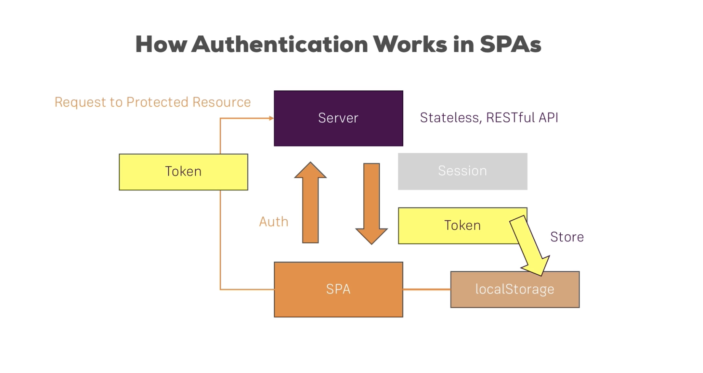

### Book Barn (Protecting Client Side Routes) 

 In this assignment, you will continue to work on your Book Barn project. Currently, your app does not protect client side routes. This means a user can simply change the url and visit a different screen of the app. You will use React higher order components to implement client side routes for your app. 

**New features are in bold** 

Your app should consists of the following features: 

- Allow the user to add new books 

- Allow the user to view all books 

- Allow the user to delete books 

- Allow the user to update books 

- Create separate pages for adding, viewing the books using React Router 

- Allow the user to filter books based on the genre

- Add the ability for the user to add books to their cart. The items count should be stored in Redux global state  

- User should be able to see the cart count in all of the pages. Display the cart count on the upper right hand corner of the page 

- Allow the user to register for a new account 

- Allow the user to login. After successful login, update the isAuthenticated global state to true. 

- Toggle the menu options depending on the user logged in status. The isAuthenticated flag can be stored in Redux global state. 

- Add the capability to allow the user to add books to the favorite list (maintained in Redux state). 

- Create multiple users managing isAuthenticated, cartCount and favorite books (3 reducers in total) 

- Create action types and update your reducer(s) to use switch statement instead of if-else 

- Create action creators to replace your dispatch action arguments in React components. 

- Take a look at your React components and see if you can update them to be be functional components. 

- Allow the user to add email address or username to register for the website

- Add JSONWebToken authentication to the website 

- Add "My Books" and "Profile" route and make it a protected route 

- Profile page will allow the user to update the email address

- Add the ability to logout the user 

- Deploy the website and the server separately  

**- Add higher order components to protect your client side routes** 

**-Make sure the menu items toggle based on the authentication status**

**- Introduce an ENV file to store environment variables associated with your application**

 
**- HARD MODE** 

- **Allow the user to filer the books based on the genre**